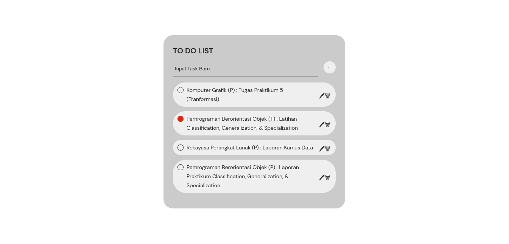

<h1 align="center">Todolist App</h1>

<p align="center">
Todolist adalah aplikasi pencatatan kegiatan.
</p>

**_Notice:_** Dibagun menggunakan MEVN Stack

## 🌟 Preview



## ✨ Features

- Create To-do
- Read To-do
- Update To-do
- Delete To-do

## ⚡ Requirements

- Node.js
- Vue.js

> Aplikasi ini menggunakan Mongodb Atlas. Jika Anda tidak bisa terkoneksi ke database, maka perlu mengganti database menjadi local, kemudian jangan lupa untuk mengubah koneksinya ke mongodb Anda.

## 🛠️ Installation

#### Clone repository

```
git clone https://github.com/madyardwn/Todolist.git
```

#### Go to repository

```
cd Todolist
```

#### Install module untuk server dan client

```
npm install && npm install --prefix client
```

#### Run

```
npm run dev
```

## ⭐ Contributor

- Achmadya Ridwan Ilyawan   - 211511001 (Backend)
- Wildan Setya Nugraha      - 211511032 (Frontend)
